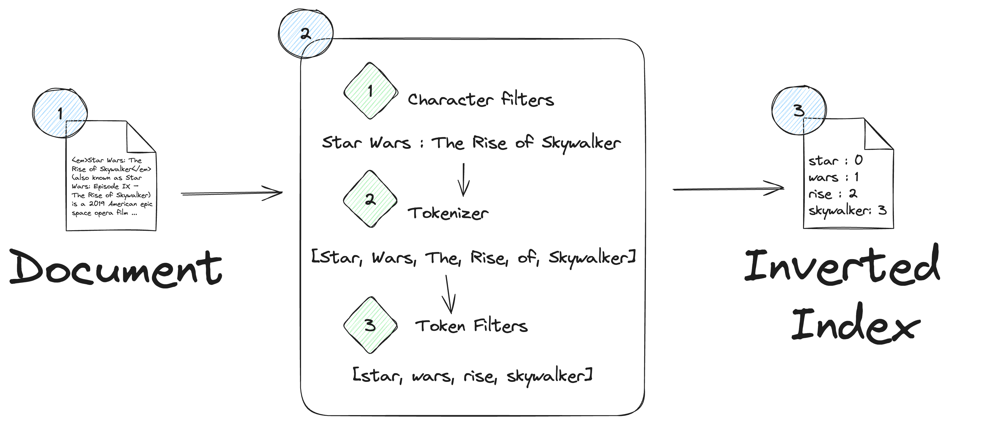

# Lab 1: Data Ingestion

In this section we are going to populate our Elasticsearch cluster with data. There are many different ways to ingest data into an Elasticsearch cluster:

1. [Elastic Beats](https://www.elastic.co/beats)
2. [Logstash](https://www.elastic.co/logstash)
3. [Elastic Agent](https://www.elastic.co/elastic-agent)
4. [Language clients](https://www.elastic.co/guide/en/elasticsearch/client/index.html) (such as the [Node.js client bulk index example](https://www.elastic.co/guide/en/elasticsearch/client/javascript-api/current/bulk_examples.html))

[TODO- change to TSDB API and add chunking with Langchain!]
For ease, in this workshop we shall use the CSV upload capabilities in Kibana to create and populate our index. An inverted index is a data structure, much like the index of a book, where key terms are stored alongside a reference to the document in which they reside:



## Steps

### Data Source

We shall be using the [Top Rated Movies dataset available in Kaggle](https://www.kaggle.com/datasets/adilshamim8/top-rated-movies-world?select=movies.json). If you have an existing Kaggle account feel free to download the JSON from the dataset page:

https://www.kaggle.com/datasets/adilshamim8/top-rated-movies-world?select=movies.json

Alternatively, please use the [provided JSON in the `data` folder](../movie-rag/src/embeddings/data).

### Document Ingestion

1. Obtain your sample `.env` file from the instructor, and move it to the `movie-rag` folder. If using `direnv`, running `direnv allow` will refresh your env variables, which should be similar to the following:

```zsh
ELASTIC_DEPLOYMENT=https://1d128591448540e39104d12ed630c500.eu-west-2.aws.cloud.es.io:443
ELASTIC_API_KEY=NFMyYVk1TUJGWHE0bEFjb3lDYjY6VEtWSy1HLXhSLWlXYW1HR1BGNXpxZw==
INDEX_NAME="movies"
```

2. Install the Elasticsearch JavaScript client under the `ingestion` folder:

```zsh
cd movie-rag/src/ingestion
npm install @elastic/elasticsearch
```

3. Open the file `ingest_documents_only.ts` and initialize the Elasticsearch client:

```js
import { Client, type ClientOptions } from "@elastic/elasticsearch";

// Initialize Elasticsearch
const config: ClientOptions = {
  node: process.env.ELASTIC_DEPLOYMENT,
  auth: {
    apiKey: process.env.ELASTIC_API_KEY || "",
  },
};
const client = new Client(config);
const indexName = process.env.INDEX_NAME;
```

4. Write a utility function to load the sample data from file `data/movies.json`:

```js
import fs from "node:fs";
import { Movie, MovieCollection } from "./movies";

/**
 * Generate collection of documents from specified JSON file
 * @param pathToJSON file containing movies
 * @returns array of documents
 */
async function generateDocumentsFromJson(pathToJSON: string): Promise<Movie[]> {
  try {
    const jsonDocs: MovieCollection = JSON.parse(
      fs.readFileSync(pathToJSON).toString()
    );
    console.log(`Doc count: ${jsonDocs.results.length}`);

    return jsonDocs.results;
  } catch (e) {
    console.log(e);
    return [];
  }
}
```

5. Write a main function to create the index and ingest the documents, validating that `20` documents are ingested:

```js
async function main() {
  // Clean up index if it exists
  if (indexName && (await client.indices.exists({ index: indexName }))) {
    await client.indices.delete({ index: indexName });
  }

  // Create index
  await client.indices.create({ index: indexName });

  // Load data from JSON
  const documents = await generateDocumentsFromJson("./data/movies.json");

  // Ingest documents as they are
  // Index with the bulk helper
  const bulkResponse = await client.helpers.bulk({
    datasource: documents,
    onDocument: (doc) => ({ index: { _index: indexName } }),
  });

  const itemCount = await client.count({ index: indexName });
  console.log(`Ingested ${itemCount.count} documents`);
}

main();
```

6. Create a new helper function `findRelevantMovies` to run a simple match query to find titles containing the provided parameter `text`:

```js
/**
 * Example search function to find relevant movies
 * @param text: prompt to be used for similarity search
 * @returns
 */
async function findRelevantMovies(text: string): Promise<Movie[]> {
  try {
    const searchResults = await client.search({
      index: indexName,
      query: {
        match: {
          title: text
        }
      }
    });
    return searchResults.hits.hits.map(hit => {
      return hit._source as Movie;
    });
  } catch (e) {
    console.log(e);
    return [];
  }
}
```

7. Amend the `main` method to find movies containing "Venom" in the title:

```js
// Example retrieval
async function main() {
    // Prior code goes here

    const character = "Venom";
    const topMovieResults = await findRelevantMovies(character);
    const title = topMovieResults.length > 0 ? topMovieResults[0]._source.title : 'UNKNOWN';
    
    console.log(`The movie featuring ${character} is: "${title}"`);
}
```

## Expected Result

If all goes well you should see that the console confirms that documents have been ingested and that a movie named *Venom* matches our query:

```
Doc count: 20
Ingested 20 documents
The movie featuring Venom is: "Venom"
```

Please contact the facilitator if you see any failure messages.