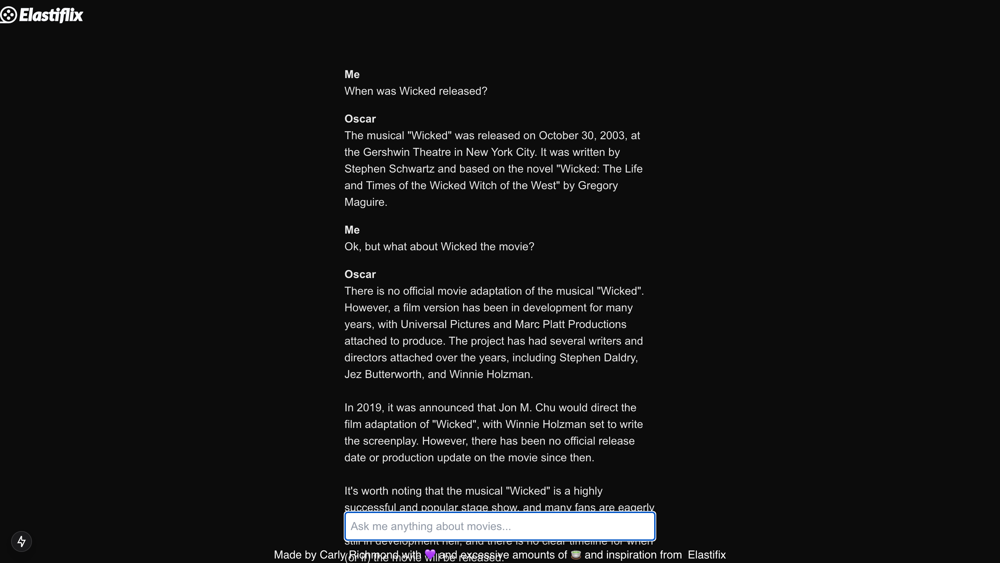

# Lab 5: LLM usage with Vercel AI

Now that we understand simple search integration with a web application, let's move onto integrating our first LLM. 

## What is an LLM?

We've all heard of Chat-GPT, and probably use it for a variety of different tasks in our daily lives. But have you ever stopped to think about what an LLM is? Or what other models are out there besides Chat-GPT?

A Large Language Model, or LLM, is a machine learning model designed for natural language processing tasks, such as language generation. They are trained on exceptionally large datasets to build a neural network that allows it to generate and predict new content.

Modern LLMs use transformer architectures, as popularized by the Google paper [Attention Is All You Need](https://arxiv.org/pdf/1706.03762). Unlike earlier approaches this allows parallelizability, making it useful for natural language processing tasks.

Picking a model is hard. There are numerous models available on open repositories such as [Hugging Face](https://huggingface.co/spaces/open-llm-leaderboard/open_llm_leaderboard) and [Ollama](https://ollama.com/search). We shall use [`llama3`](https://ollama.com/library/llama3) from Meta, which is the default for text generation tasks.

For your own projects, when evaluating models make sure to check the model card on the repository, such [as this one for Llama3.1](https://github.com/meta-llama/llama-models/blob/main/models/llama3_1/MODEL_CARD.md), specifically focusing on:

1. License conditions, ethical considerations and any other usage conditions.
2. Parameters.
3. Modality, particularly for multi-modal use cases involving images, sound and text.
4. Content length.
5. Size and hardware requirements.
6. Training dataset.

## Steps

1. Similar to the steps for downloading the manifest of the embedding model as per [lab 2](./2-vector-embeddings.md), download Llama 3 using Ollama via the terminal:

```zsh
ollama pull llama3
ollama list
```

2. Test the model is able to generate a response via the `run` command from Ollama:

```zsh
ollama run llama3
>>> Why is the sky blue and not green?
```

You should receive a very wordy response! 😅

3. To integrate with our model via React (in this case leveraging a simple Next.js application), we need to create a client side route for our chatbot Oscar (🏆). We are going to use [AI SDK UI by Vercel](https://sdk.vercel.ai/docs/ai-sdk-ui/overview), which is an open source framework providing React hooks to ease AI application development.

To use AI and AI UI SDKs, the following npm installations are required:

```zsh
npm install ai @ai-sdk/openai
```

4. Amend the page [oscar/page.tsx](../movie-rag/src/app/oscar/page.tsx) to use the [`useChat` hook](https://sdk.vercel.ai/docs/ai-sdk-ui/chatbot):

```tsx
'use client';

import { useChat } from 'ai/react';

export default function Chat() {
  const { messages, input, handleInputChange, handleSubmit } = useChat();
  return (
    <div className="flex flex-col w-full max-w-md py-24 mx-auto stretch">
      <div className="space-y-4">
        {messages.map(m => (
          <div key={m.id} className="whitespace-pre-wrap">
            <div>
              <div className="font-bold">{m.role === "assistant" ? "Oscar" : "Me"}</div>
              <p>{m.content}</p>
            </div>
          </div>
        ))}
      </div>

      <form onSubmit={handleSubmit}>
        <input
          className="fixed bottom-0 w-full max-w-md p-2 mb-8 border border-gray-300 rounded shadow-xl"
          value={input}
          placeholder="Ask me anything about movies..."
          onChange={handleInputChange}
        />
      </form>
    </div>
  );
}
```

5. By default, the `useChat` hook sends a HTTP POST request to the `/api/chat` endpoint with the message list as a request body. Although this is configurable using the `api` option, here we shall create a new route `/api/chat` to handle interactions with the LLM via Ollama:

```tsx
import { createOllama } from 'ollama-ai-provider';
import { streamText } from 'ai';

// Allow streaming responses up to 30 seconds
export const maxDuration = 30;

const ollama = createOllama({
  baseURL: 'http://localhost:11434/api', // Default
});

export async function POST(req: Request) {
  const { messages } = await req.json();
  
  try {
    const result = streamText({
      model: ollama('llama3'),
      messages
    });
  
    return result.toDataStreamResponse();
  } catch(e) {
    console.error(e);
    return { message: "Oscar is currently watching a movie. Please try again later!" }
  }
}
```

## Expected Result

Through this simple example we have created a simple chatbot that can engage with our questions and stream responses back:



However, there are limitations with this implementation when building an enterprise chatbot:

1. It is limited to knowledge contained in the training data. For this reason, when we ask when the Wicked movie was released, it tells us about the musical instead.
2. Is it using the user messages only as the input, which gives us a lack of flexibility in what the chatbot can respond.